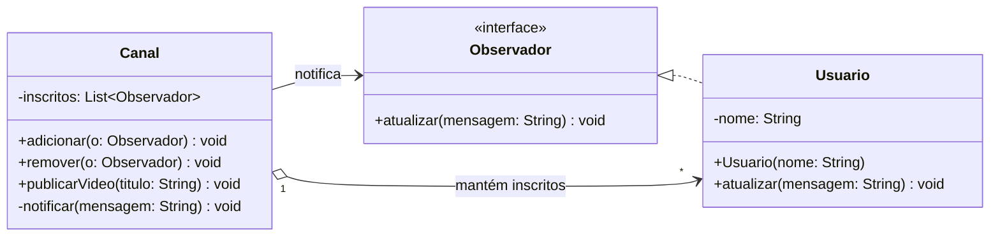

# Observer

Observer é um padrão de projetos comportamental em que é possível criar um sistema de assinatura a fim de de notificar vários objetos sobre quaisquer eventos que esses estejam observando. Um problema muito comum que esse padrão resolve é uma loja que possui vários clientes. Se um cliente quiser comprar um produto novo que essa loja irá fornecer, ele pode ir para essa loja todos os dias. Entretanto, até o produto chegar, todas as idas desse cliente serão em vãos. Por outro lado, se uma loja enviar vários e-mails para os clientes avisando sobre a chegado de um novo produto, para o cliente interessado será bom, mas para os clientes que não estavam interessados, esses e-mails serão considerados spam. O anti-padrão do Observer seria o acoplamento forte.

