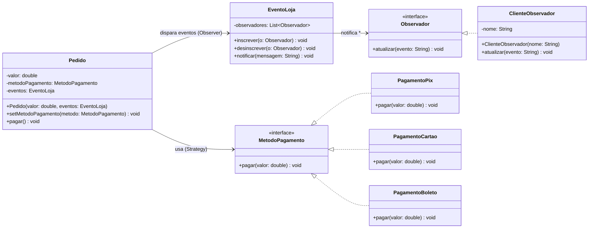

# Projeto Strategy-Observer

Este projeto usa tanto o padrão de projetos Strategy quanto o Observer

```mermaid
classDiagram
    direction LR

    %% ----------------------------
    %% Observer
    %% ----------------------------
    class Observador {
        <<interface>>
        +atualizar(evento: String) void
    }

    class ClienteObservador {
        -nome: String
        +ClienteObservador(nome: String)
        +atualizar(evento: String) void
    }

    class EventoLoja {
        -observadores: List~Observador~
        +inscrever(o: Observador) void
        +desinscrever(o: Observador) void
        +notificar(mensagem: String) void
    }

    Observador <|.. ClienteObservador
    EventoLoja --> Observador : notifica *


    %% ----------------------------
    %% Strategy
    %% ----------------------------
    class MetodoPagamento {
        <<interface>>
        +pagar(valor: double) void
    }

    class PagamentoPix {
        +pagar(valor: double) void
    }
    class PagamentoCartao {
        +pagar(valor: double) void
    }
    class PagamentoBoleto {
        +pagar(valor: double) void
    }

    MetodoPagamento <|.. PagamentoPix
    MetodoPagamento <|.. PagamentoCartao
    MetodoPagamento <|.. PagamentoBoleto


    %% ----------------------------
    %% Pedido (une os padrões)
    %% ----------------------------
    class Pedido {
        -valor: double
        -metodoPagamento: MetodoPagamento
        -eventos: EventoLoja
        +Pedido(valor: double, eventos: EventoLoja)
        +setMetodoPagamento(metodo: MetodoPagamento) void
        +pagar() void
    }

    Pedido --> MetodoPagamento : usa (Strategy)
    Pedido --> EventoLoja : dispara eventos (Observer)
```
