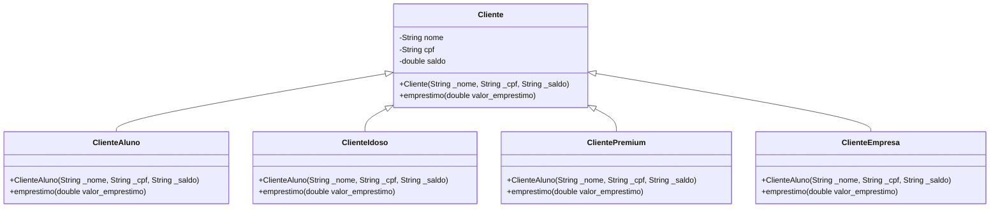

# Anti-pattern do Strategy

O anti-pattern do Strategy é a conhecida herança de classes. Muitas linguagens de programação orientada a objetos permitem a herança. Entretanto, não é um padrão de projetos muito eficiente, pois sempre haverá repetição de projetos.<br>
Abaixo, há um código em java e o diagrama UML de classes simples de empréstimo no banco:

Classe principal
```java
import models.Cliente;
import models.ClienteAluno;
import models.ClienteEmpresa;
import models.ClientePremium;
import models.ClienteIdoso;


public class Main {
    public static void main(String[] args) {
        Cliente empresa = new ClienteEmpresa("Loja XPTO", "11222333000144", 5000);
        Cliente premium = new ClientePremium("Ana", "12345678900", 5000);
        Cliente idoso = new ClienteIdoso("Dona Maria", "98765432100", 1500);
        Cliente aluno = new ClienteAluno("Bruno", "47865124685", 12000);

        empresa.emprestimo(1000);
        premium.emprestimo(1000);
        idoso.emprestimo(1500);
        idoso.emprestimo(800);

        aluno.emprestimo(6000);
    }
}
```
Classe Cliente:
```java
package models;

public class Cliente {
    public String nome;
    public String cpf;
    public double saldo;


    //Construtor
    public Cliente(String _nome, String _cpf, double _saldo){
        this.nome = _nome;
        this.cpf = _cpf;
        this.saldo = _saldo;
    }


    public String getNome() {
        return nome;
    }

    public String getCpf() {
        return cpf;
    }

    public double getSaldo() {
        return saldo;
    }

    protected void setSaldo(double saldo) {
        this.saldo = saldo;
    }

    public void emprestimo(double valor_emprestimo){
        this.saldo -= valor_emprestimo;
    }
}
```

Classe ClienteAluno:
```java
package models;

public class ClienteAluno extends Cliente{
    public ClienteAluno(String _nome, String _cpf, double _saldo){
        super(_nome, _cpf, _saldo);
    }

    @Override
    public void emprestimo(double valor_emprestimo){
        if (valor_emprestimo > 5000) {
            System.out.println(getNome() + " (Cliente Aluno) não pode pegar empréstimos acima de R$ 1000.");
        } else {
            setSaldo(getSaldo() - valor_emprestimo);
            System.out.println(getNome() + " (Cliente Aluno) fez um empréstimo de R$ " + valor_emprestimo + ". Novo saldo: " + getSaldo());
        }
    }
}
```

Classe ClienteIdoso:
```java
package models;

public class ClienteIdoso extends Cliente{
    public ClienteIdoso(String _nome, String _cpf, double _saldo) {
        super(_nome, _cpf, _saldo);
    }

    @Override
    public void emprestimo(double valor) {
        if (valor > 1000) {
            System.out.println(getNome() + " (Idoso) não pode pegar empréstimos acima de R$ 1000.");
        } else {
            setSaldo(getSaldo() - valor);
            System.out.println(getNome() + " (Idoso) fez um empréstimo de R$ " + valor + ". Novo saldo: " + getSaldo());
        }
    }
}
```

Classe ClientePremium:
```java
package models;

public class ClientePremium extends Cliente {

    public ClientePremium(String _nome, String _cpf, double _saldo){
        super(_nome, _cpf, _saldo);
    }

    @Override
    public void emprestimo(double valor) {
        if (valor > 50000) {
            System.out.println(getNome() + " (Cliente Premium) não pode pegar empréstimos acima de R$ 50.000.");
        } else {
            setSaldo(getSaldo() - valor);
            System.out.println(getNome() + " (Cliente Premium) fez um empréstimo de R$ " + valor + ". Novo saldo: " + getSaldo());
        }
    }
}
```

Classe ClienteEmpresa:
```java
package models;

public class ClienteEmpresa extends Cliente{
    public ClienteEmpresa(String _nome, String _cpf, double _saldo){
        super(_nome, _cpf, _saldo);
    }

    @Override
    public void emprestimo(double valor) {
        double limite = valor * 2; // Empresa tem crédito maior
        setSaldo(getSaldo() - limite);
        System.out.println(getNome() + " (Empresa) fez um empréstimo de R$ " + limite + ". Novo saldo: " + getSaldo());
    }
}

```



