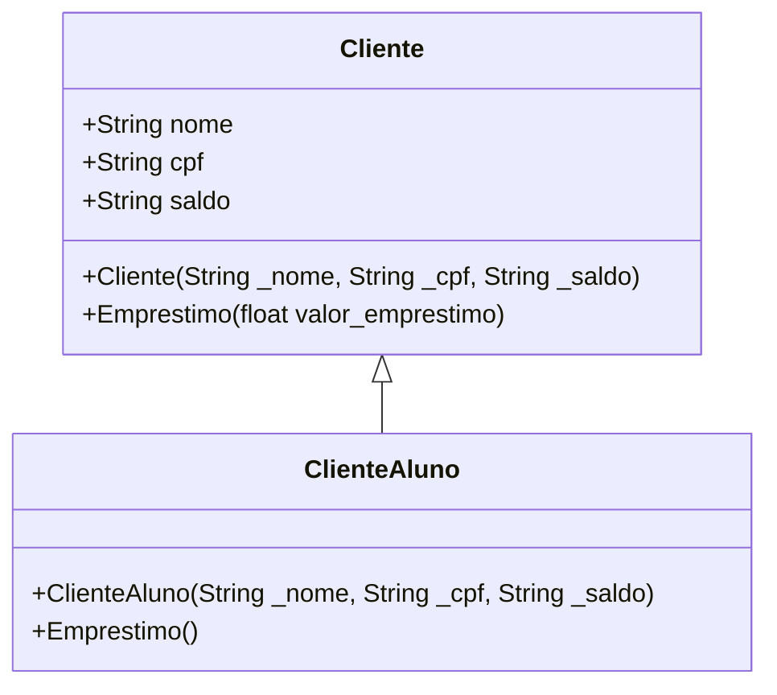

# Anti-pattern do Strategy

O anti-pattern do Strategy é a conhecida herança de classes. Muitas linguagens de programação orientada a objetos permitem a herança. Entretanto, não é um padrão de projetos muito eficiente, pois sempre haverá repetição de projetos.<br>
Abaixo, há um código em java e o diagrama UML de classes simples de empréstimo no banco:

Classe principal
```java
public class Main {
    public static void main(String[] args) {
        // This line prints "Hello, World!" to the console
        System.out.println("Hello, World!");
    }
}
```
Classe Cliente:
```java
public class Cliente {
    public String nome;
    public String cpf;
    public String saldo;


    //Construtor
    public Cliente(String _nome, String _cpf, String _saldo){
        this.nome = _nome;
        this.cpf = _cpf;
        this.saldo = _saldo;
    }

    public void Emprestimo(float valor_emprestimo){
        float valor = Float.parseFloat(this.saldo);
        float valor_resultante = valor - valor_emprestimo;
        this.saldo = Float.toString(valor_resultante);
    }
}
```

Classe ClienteAluno:
```java
public class ClienteAluno extends Cliente{
    public ClienteAluno(String _nome, String _cpf, String _saldo){
        super(_nome, _cpf, _saldo);
    }

    public void Emprestimo(){
        System.out.println("Você não pode fazer empréstimo com a conta de estudante.");
    }
}
```


